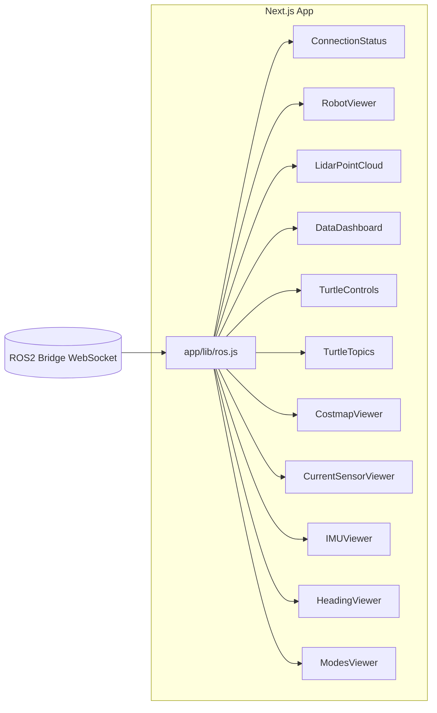

# robot-app

A Next.js Application for Robot Visualization and Control via ROS2.

## Overview

robot-app is a Next.js (App Router) project that connects to a ROS2 Bridge WebSocket (using `app/lib/ros.js`) to send and receive ROS messages, providing real-time visualization and control interfaces for robots.

## Features

- **ROS2 Connection Status** (`ConnectionStatus` component)
- **3D Robot Model Rendering** (`RobotViewer`)
- **LIDAR Point Cloud Display** (`LidarPointCloud`)
- **Telemetry Dashboard** (`DataDashboard` with `BatteryGauge`, `Speedometer`, `WaypointPanel`)
- **TurtleBot Control Interface** (`TurtleControls`, `TurtleTopics`)
- **Sensor Viewers**
  - Costmap (`CostmapViewer`)
  - Current Sensor (`CurrentSensorViewer`)
  - IMU (`IMUViewer`)
  - Heading/Compass (`HeadingViewer`)
  - Mode Selector (`ModesViewer`)
- **Shared Layout & Theming** (`MainLayout`, `ColorModeContext`)

## Getting Started

```bash
cd robot-app
npm install
npm run dev
```

Open [http://localhost:3000](http://localhost:3000) in your browser.

## Project Structure

```
robot-app
├── app
│   ├── components
│   │   ├── layout/MainLayout.js
│   │   ├── ros/ConnectionStatus.js
│   │   ├── robot/RobotViewer.js
│   │   ├── lidar/LidarPointCloud.js
│   │   ├── dashboard/DataDashboard.js
│   │   ├── turtle/TurtleControls.js, TurtleTopics.js
│   │   ├── costmap/CostmapViewer.js
│   │   ├── current-sensor/CurrentSensorViewer.js
│   │   ├── imu/IMUViewer.js
│   │   ├── heading/HeadingViewer.js
│   │   └── modes/ModesViewer.js
│   ├── lib
│   │   ├── ros.js (ROS connection)
│   │   └── ColorModeContext.js
│   ├── page.js (Home dashboard)
│   └── ... other pages for each viewer
├── next.config.mjs (three.js alias config)
└── README.md (this file)
```

## Architecture Diagram


